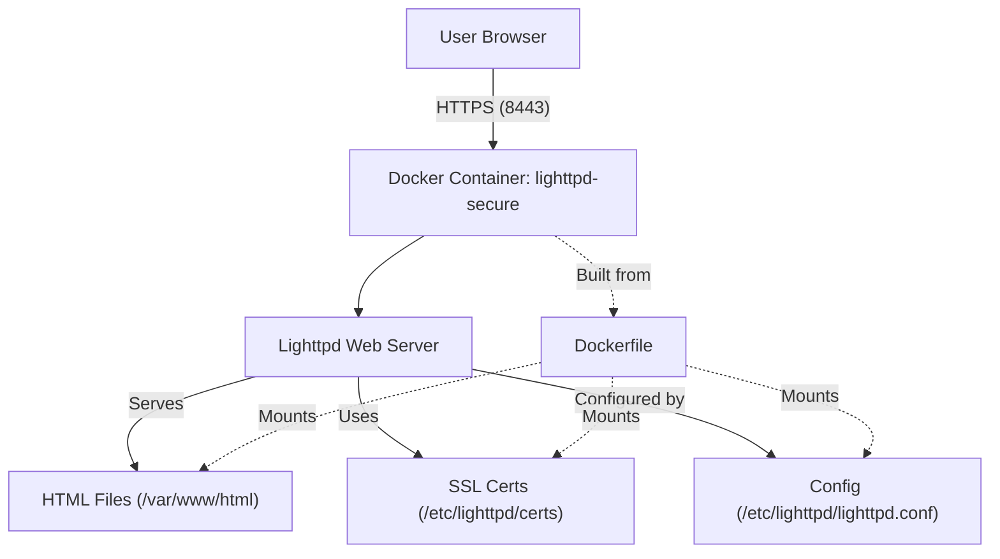

# Lighttpd Docker HTTPS Example

This project demonstrates running a secure (HTTPS) Lighttpd server in Docker with self-signed SSL certificates.

## Architecture Overview

The following diagram shows how the components interact:



## Prerequisites
- Docker installed
- OpenSSL installed (for generating certificates)

## Setup Steps

### 1. Generate SSL Certificates

```sh
openssl req -x509 -nodes -days 365 -newkey rsa:2048 \
  -keyout certs/server.key \
  -out certs/server.crt \
  -subj "/C=US/ST=Denial/L=Springfield/O=Dis/CN=localhost"

cat certs/server.key certs/server.crt > certs/server.pem
```

This creates `server.key`, `server.crt`, and `server.pem` in the `certs/` directory.

### 2. Create Example HTML Files

```sh
echo "Welcome to index.html" > html/index.html
echo "Welcome to index2.html" > html/index2.html
echo "Welcome to index3.html" > html/index3.html
```

### 3. Build the Docker Image

```sh
docker build -t my-lighttpd .
```

### 4. Run the Container

```sh
docker run -d --name lighttpd-secure \
  -p 8443:443 \
  -v $PWD/html:/var/www/html \
  -v $PWD/conf/lighttpd.conf:/etc/lighttpd/lighttpd.conf \
  -v $PWD/certs:/etc/lighttpd/certs \
  my-lighttpd
```

### 5. Check Logs and Stop/Remove Container

```sh
docker logs lighttpd-secure
docker stop lighttpd-secure
docker rm lighttpd-secure
```

## Notes
- The `certs/` directory is ignored by git (see `.gitignore`).
- The Lighttpd config is in `conf/lighttpd.conf`.
- HTML files are in `html/`.
- The server runs on https://localhost:8443
